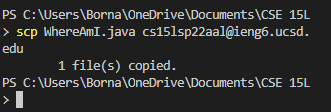
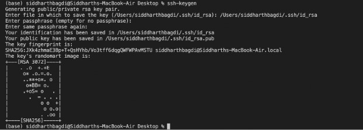
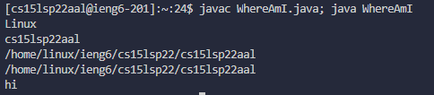
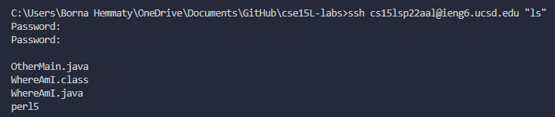

# CSE 15L Tutorial

## Installing VScode
- Go to the **[VScode Download](https://code.visualstudio.com/Download)** link to download the program.

- install the version of VScode for your operating system and run the file.


---
## Remotely Connecting
- You want to start by opening up **terminal** either on **VScode** or your machine.


- Then you want to type the command `ssh [username]@ieng.ucsd.edu` to log into your remote machine.
- You are then prompted to input a **password** and afterwards you should be connected like so:


---
## Trying Some Commands
### You can try some of these commands in the **terminal**: 
```
- cd ~
- cd
- ls -lat
- ls -a
- ls <directory> where <directory> is /home/linux/ieng6/cs15lsp22/cs15lsp22abc, where the *abc* is one of the other group members’ username
- cp /home/linux/ieng6/cs15lsp22/public/hello.txt ~/
- cat /home/linux/ieng6/cs15lsp22/public/hello.txt
```
- cd is for opening directories
- ls is for listing directories (with various modifiers)
- cp is for copying files
- cat copies files and prints theoutput in terminal


---
## Moving Files with `scp`

- Using the `scp [file name] [username]@ieng6.ucsd.edu` on your local **terminal** you can copy a file over to your remote server

- Make sure you re-enter your password and that the copy was sucessful



---
## Setting an SSH Key
- Creating an SSH Key will make loging into your personal remote machine without you having to login

```
# on client (your computer)
$ ssh-keygen
Generating public/private rsa key pair.
Enter file in which to save the key (/Users/<user-name>/.ssh/id_rsa): /Users/<user-name>/.ssh/id_rsa
Enter passphrase (empty for no passphrase):  (Do not add a parahrase)
```

- The outcome should look like this:



- Then you have to input:

```
$ ssh cs15lsp22zz@ieng6.ucsd.edu
<Enter Password>
# now on server
$ mkdir .ssh
$ <logout>
# back on client
$ scp /Users/<user-name>/.ssh/id_rsa.pub cs15lsp22zz@ieng6.ucsd.edu:~/.ssh/authorized_keys
# You use your username and the path you saw in the command above
```

- Next time you login you with `ssh` you will not have to input a password
---
## Optimizing Remote Running
- Use the `;` command to string together multiple commands in your terminal to run multiple commands.
- Using this command you can string together lines of commands into a single command



- Another command you can use is quotations `""` after ssh command to run commands post ssh



