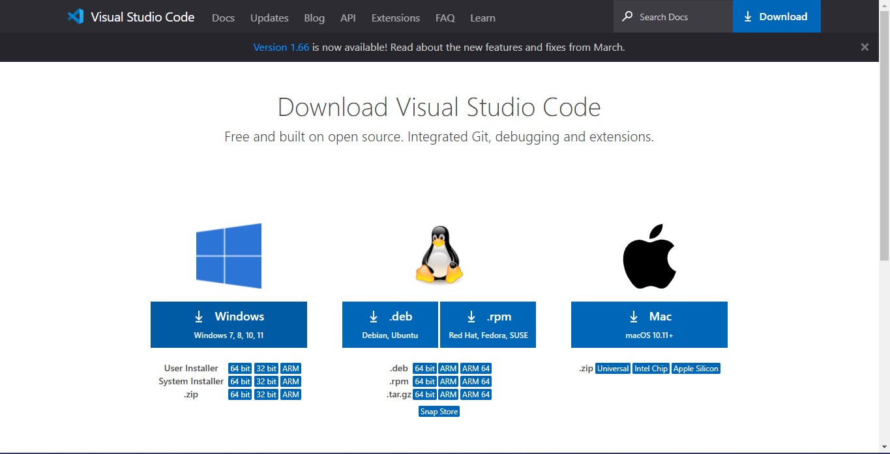
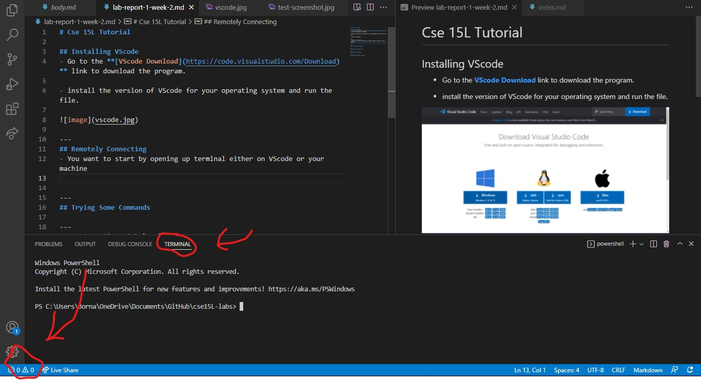
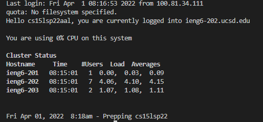
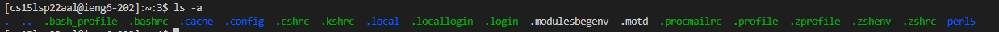

# CSE 15L Tutorial

## Installing VScode
- Go to the **[VScode Download](https://code.visualstudio.com/Download)** link to download the program.

- install the version of VScode for your operating system and run the file.



---
## Remotely Connecting
- You want to start by opening up **terminal** either on **VScode** or your machine.



- Then you want to type the command `ssh [username]@ieng.ucsd.edu` to log into your remote machine.
- You are then prompted to input a **password** and afterwards you should be connected like so:



---
## Trying Some Commands
### You can try some of these commands in the **terminal**: 
```
- cd ~
- cd
- ls -lat
- ls -a
- ls <directory> where <directory> is /home/linux/ieng6/cs15lsp22/cs15lsp22abc, where the *abc* is one of the other group members’ username
- cp /home/linux/ieng6/cs15lsp22/public/hello.txt ~/
- cat /home/linux/ieng6/cs15lsp22/public/hello.txt
```


---
## Moving Files with `scp`

- Using the `scp [file name] [username]@ieng6.ucsd.edu` on your local **terminal** you can copy a file over to your remote server

- Make sure you re-enter your password and that the copy was sucessful

---
## Setting an SSH Key
- Creating an SSH Key will make loging into your personal remote machine without you having to login
---
## Optimizing Remote Running
