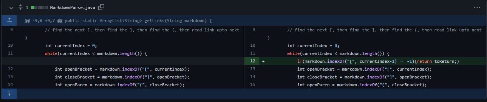
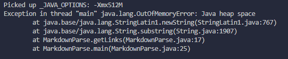

# Lab report 2
## Change #1
- This change makes it so that it ignores the bug, which would be any `\n` arguments causing an infinate loop. Symptoms of this bug include java heap running out of memory when the length is still greater than the current index but no brackets are found. 
- Stopping the code with an if statement to determine when a bracket is no longer visible after the current index would end the loop when no other bracket is found.

[[Bugged Case File](https://github.com/Borna1103/cse15L-labs/blob/main/Error1.md?plain=1)]

### Failure Output

## Change #2
- This change makes it so that it ignors embedded links with no link within the parenthesis. The bug is a output with a link string of 0 length. The symptoms of this would be an output of empty strings in the `toReturn` list.
- A fix for this would be adding an if statement to ignore any embedded links with nothing inside the parenthesis. And an else statement to continue with the code if there is a link in the embedded link.

[[Bugged Case File](https://github.com/Borna1103/cse15L-labs/blob/main/Error2,md)]

### Failure Output

## Change #3
- This change makes it so an empty file will not return anything and instead throw an exceptoion. The bug here is that the code runs when there is nothing to read in the file and returns an Empty Array. A symptom of this bus is that the resultant is a print of an empty ArrayList, showing brackets and nothing inside.
- Fixing this bug included creating an if statement that would throw an exception if at the end of the code `toReturn` were to have a length of 0.

[[Bugged Case File](https://github.com/Borna1103/cse15L-labs/blob/main/Error3.md)]

### Failure Output

