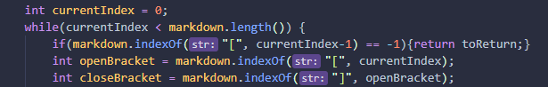

# Lab report 2
## Change #1
- This change makes it so that it ignores the bug, which would be any `\n` arguments. Symptoms of this bug include the code running in an infinateloop when the length is still greater than the current index but no brackets are found. Skipping the `\n` argument would end the loop when no other bracket is found.

### Failure Output
